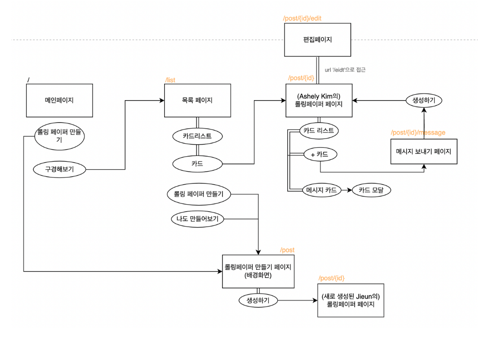
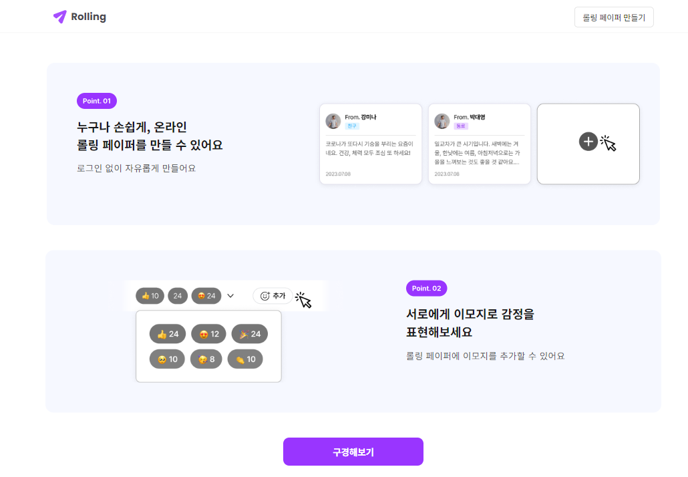
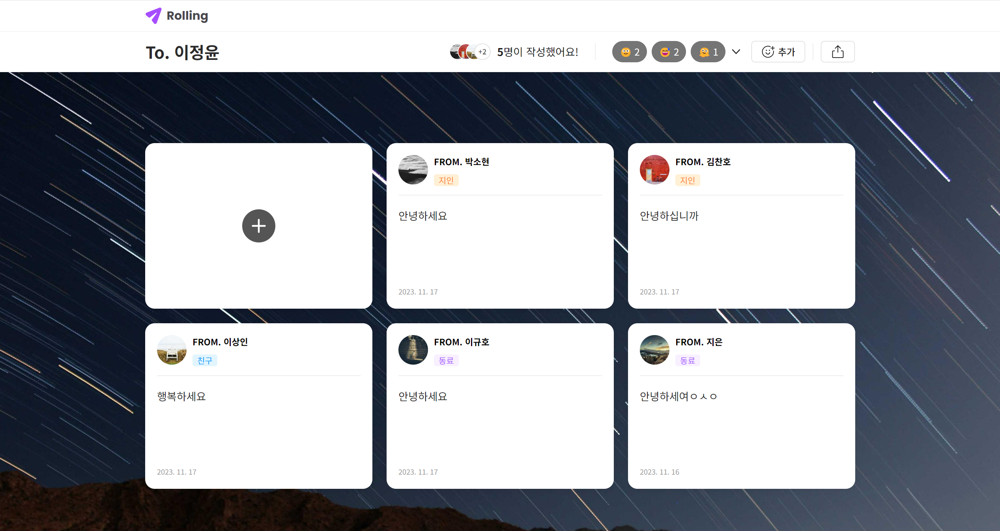
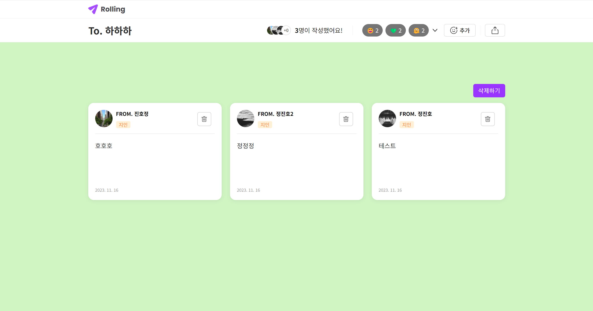
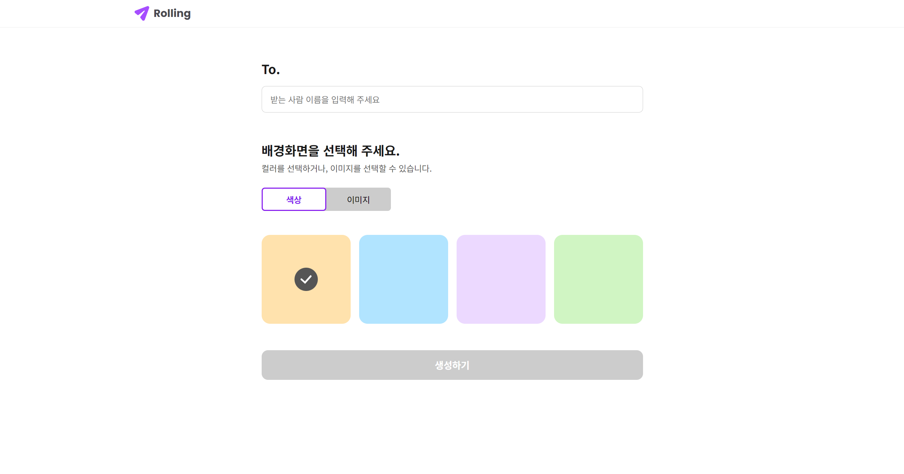
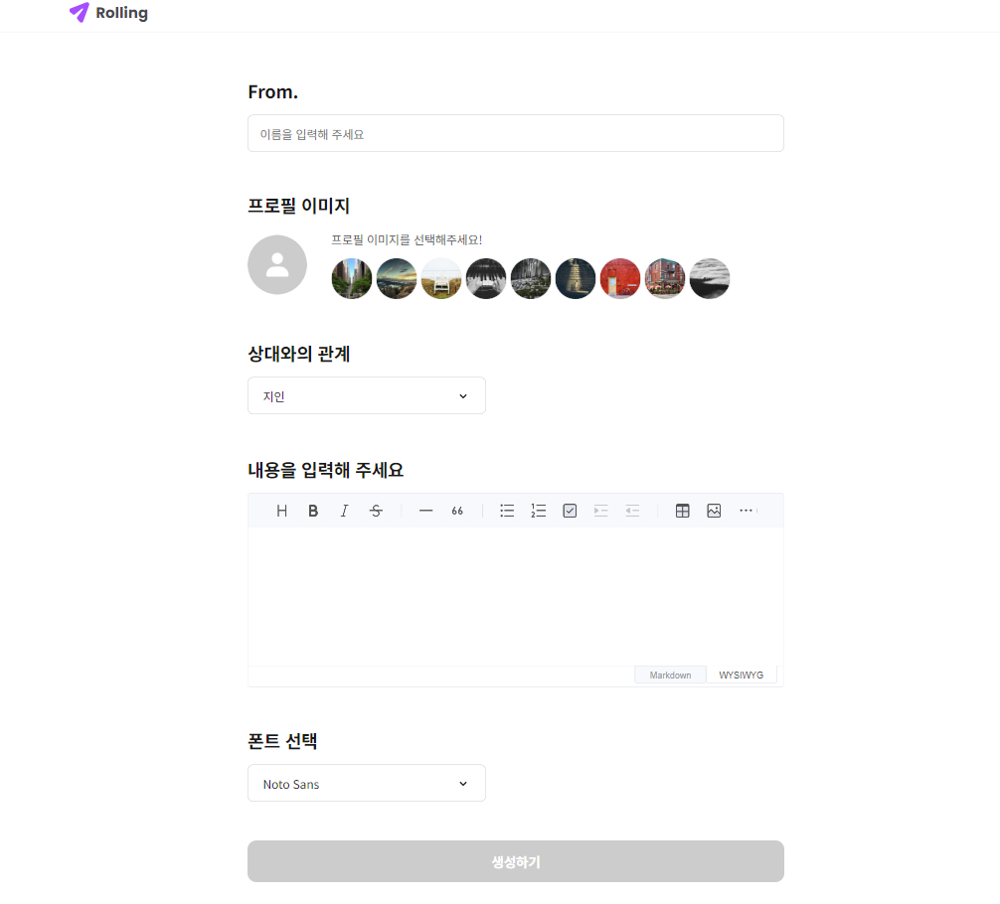

<div align="center">
<h1>🌀 Rolling 🌀</h1>
</div>

<p align="center">

</p>

<div align="center">

[](https://hits.seeyoufarm.com)

</div>

## 👥 팀원

<div align="center">

|                            [손지은](https://github.com/wise-Ag)                            |                      [이규호](https://github.com/leegyuho-programer)                       |                           [이정윤](https://github.com/lsc58461)                           |                              [정진호](https://github.com/ayden94)                               |                           [조연아](https://github.com/yunajoe)                            |
| :----------------------------------------------------------------------------------------: | :----------------------------------------------------------------------------------------: | :---------------------------------------------------------------------------------------: | :---------------------------------------------------------------------------------------------: | :---------------------------------------------------------------------------------------: |
|  |  |  |  |  |

역할 : https://www.notion.so/rolling-6-b85fd78e57cd4e58a3cd4b041df69b6f

</div>

## 🌐 배포 주소

> https://rollingpaper-team6.netlify.app/<br>

## 🛠️ Prettier, ESLint, Husky

> https://thrilling-taste-dd3.notion.site/lint-prettier-postCSS-husky-0d5929422c694d77815b638150507f9b

## ℹ️ 프로젝트 소개

> 이름: 🌀 Rolling 🌀<br>
> 개발 기간: 2023.11.03-2023.11.18<br>

롤링페이퍼라는 주제로 사람들이 서로에게 감사나 축하 또는 전달하고 싶은 메시지를 전달할 수 있는 디지털 플랫폼입니다. 사용자는 이 플랫폼을 통해 친구, 가족, 동료 등에게 마음을 전달하는 디지털 롤링페이퍼를 생성할 수 있습니다.

사용자는 먼저 롤링페이퍼를 생성하며, 이때 배경색이나 배경이미지를 선택하여 자신만의 개성을 담을 수 있습니다. 생성된 롤링페이퍼는 고유한 URL을 통해 다른 사람들이 접근 가능하며, 방문자들은 간단한 폼을 통해 메시지를 남길 수 있습니다.

이 프로젝트는 React를 기반으로 개발되었으며, 반응형 디자인이 적용되어 다양한 디바이스에서도 사용이 가능합니다. 또한, 사용자 인증 기능을 통해 롤링페이퍼의 작성자만이 롤링페이퍼를 편집하거나 삭제할 수 있도록 보안이 강화되어 있습니다.

이러한 기능들을 통해 사용자들은 감사, 축하, 응원 등의 다양한 감정을 표현하고 공유할 수 있는 공간을 가질 수 있습니다. 디지털 환경에서도 사람들이 마음을 나누는 따뜻한 순간을 만들어 주는 프로젝트입니다.

## 🚀 시작 가이드

- 프로젝트를 클론(clone)합니다
  ```
  git clone https://github.com/Project-TeamSix/Rolling-Project.git
  ```
- 프로젝트 폴더로 이동합니다
  ```
  cd Rolling-Project
  ```
- 필요한 패키지들을 설치합니다
  ```
  npm install
  ```
- React 프로젝트는 보통 npm start 또는 yarn start 명령어로 로컬 개발 서버를 실행하고 컴파일합니다.
  ```
  npm start
  ```
  ```
  yarn start
  ```

## 💻 개발 스택

<br>
<br>
<br>
<br>
<br>
<br>
<br>
<br>
<br>
<br>

## 📂 디렉토리 구조

```
# 가독성을 위해 다수 생략 되었습니다.
└── src/
    ├── assets/
    │   │   # 정적 에셋들이 포함되어있습니다.
    │   ├── font/
    │   ├── logo/
    │   └── styles/
    ├── apis/
    │   │   # API 설정과 비동기 요청 함수들이 포함되어 있습니다.
    │   ├── apiConfig.js
    │   └── getRecipientMessages.js
    ├── components/
    │   │   # 각 페이지에 결합되는 컴포넌트들이 포함되어있습니다.
    │   ├── header/
    │   ├── BadgeEmoji/
    │   │   ├── BadgeEmoji.jsx
    │   │   └── BadgeEmoji.module.css
    ├── contexts/
    │   │   # 전역적으로 관리할 수 있는 콘텍스트가 포함되어있습니다.
    │   └── LocaleContext.js
    ├── hooks/
    │   │   # 커스텀 훅이 포함되어 있습니다.
    │   ├── useAsync.jsx
    ├── pages/
    │   │   # 각 페이지 단위
    │   ├── LandingPage.jsx
    │   └── LandingPage.module.css
    └── utils/
        │   # 유틸리티들이 포함되어있습니다.
        └── convertDateFormat.js
```

## 🏗️ 프로젝트 구조 다이어그램



## 🖼️ 결과물

LandingPage<br>
<br>
ListPage<br>
<br>
PostPage<br>
<br>
EditPage<br>
<br>
CreateToPage<br>
<br>
CreateFromPage<br>
<br>

## 📝 간단한 사용 방법

- 웹사이트에 접속하여 '롤링페이퍼 생성' 버튼을 클릭합니다.
- 배경색이나 배경 이미지를 선택하고, 롤링페이퍼 이름을 입력합니다.
- 생성된 롤링페이퍼의 URL을 복사하여 친구들에게 공유합니다.
- 친구들은 URL에 접속하여 메시지를 남깁니다.
